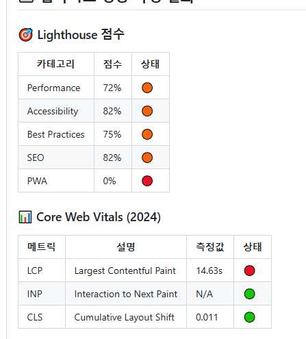
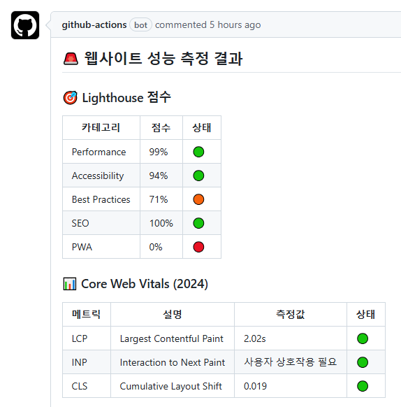
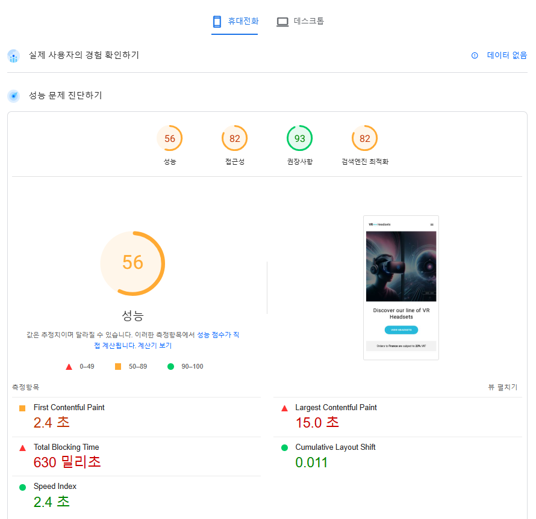
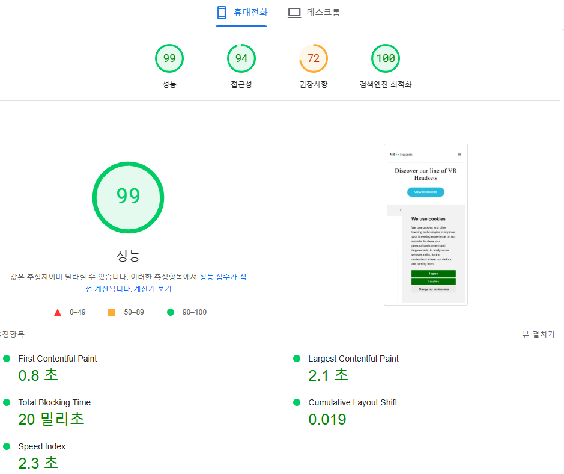
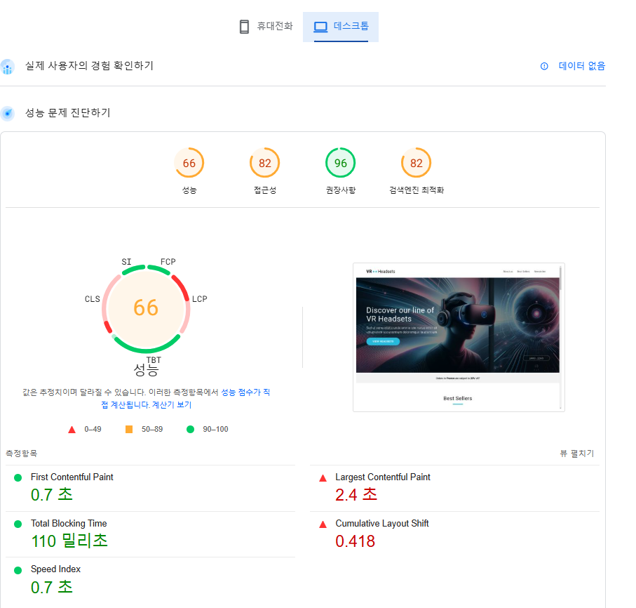
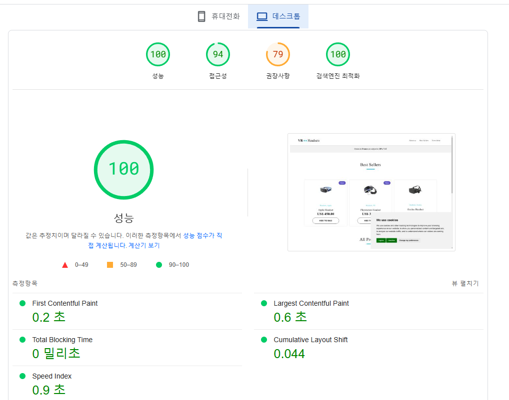

# 성능 개선 보고서

## 측정 도구

- Lighthouse (issued by github action)
- [PageSpeed Insight](https://pagespeed.web.dev/)

## 분석 지표

### 1. 로딩 성능

- **FCP (First Contentful Paint)**: 페이지의 첫 번째 콘텐츠가 화면에 렌더링되는 데 걸리는 시간.
- **LCP (Largest Contentful Paint)**: 화면에서 가장 큰 콘텐츠가 렌더링 완료되는 시간.
- **TTI (Time to Interactive)**: 페이지가 사용자와 완전히 상호작용할 준비가 되는 시간.
- **TBT (Total Blocking Time)**: 브라우저가 렌더링을 차단당한 총 시간.
- **Speed Index**: 페이지 콘텐츠가 시각적으로 얼마나 빨리 로드되는지를 나타내는 지표.

### 2. 렌더링 성능

- **CLS (Cumulative Layout Shift)**: 페이지에서 예상치 못한 레이아웃 이동의 누적 비율을 나타내며, 안정적인 사용자 경험을 위한 중요한 지표.

### 3. 자바스크립트 성능

- **실행 시간**: DOM이 준비되고 사용자와 상호작용 가능해지며 페이지가 완전히 로드되기까지의 전반적인 시간  
  _(DOM Content Loaded, Interactive, Onload Time 포함)_.

### 4. 네트워크 성능

- **Resource Size**: 페이지 로딩 시 다운로드되는 리소스의 총 크기.
- **Number of Requests**: 페이지를 구성하는 데 필요한 리소스 요청의 총 수.
- **TTFB (Time to First Byte)**: 서버로부터 첫 번째 바이트가 브라우저에 도달하는 데 걸리는 시간으로, 서버 응답 속도를 나타냄.

## 성능 측정 전후 결과 비교

### 종합 비교

| 항목              | 성능 개선 전                                                                           | 성능 개선 후                                                                           |
| ----------------- | -------------------------------------------------------------------------------------- | -------------------------------------------------------------------------------------- |
| Lighthouse        | [개선 전 이슈링크](https://github.com/KimMyeongSu/front_3rd_chapter4-2_basic/issues/1) | [개선 후 이슈링크](https://github.com/KimMyeongSu/front_3rd_chapter4-2_basic/issues/8) |
|                   |                              |                               |
| PageSpeed Insight |  (Mobile)            |  (Mobile)             |
|                   |  (Desktop)               |  (Desktop)                |

### 로딩 성능

| 지표        | 도구       | 개선 전   | 개선 후 | 개선율 |
| ----------- | ---------- | --------- | ------- | ------ |
| FCP         | PageSpeed  | 0.9s (PC) | 0.2s    | 78%    |
| LCP         | Lighthouse | 14.63s    | 2.02s   | 86%    |
|             | PageSpeed  | 2.9s      | 0.4s    | 86%    |
| TBT         | PageSpeed  | 0.2s (PC) | 0s      | 100%   |
| Speed Index | PageSpeed  | 1.4s (PC) | 0.6s    | 57%    |

### 렌더링 성능 (Rendering Performance)

| 지표                           | 개선 전   | 개선 후 | 개선율 | 개선 내용                                                                       |
| ------------------------------ | --------- | ------- | ------ | ------------------------------------------------------------------------------- |
| FCP (First Contentful Paint)   | 0.9s (PC) | 0.2s    | 78%    | 불필요한 렌더 차단 요소 제거 및 초기 콘텐츠 로드 최적화. CSS 및 이미지 최적화.  |
| LCP (Largest Contentful Paint) | 14.63s    | 2.02s   | 86%    | 주요 콘텐츠 Lazy Loading 및 이미지 포맷(WebP) 활용. 중요 리소스 로딩 순서 조정. |
| CLS (Cumulative Layout Shift)  | 0.418     | 0.044   | 90%    | 레이아웃 변경 최소화, 고정 크기 컨테이너 설정.                                  |

### 네트워크 성능 (Network Performance)

| 지표                      | 개선 전   | 개선 후 | 개선율 | 개선 내용                                              |
| ------------------------- | --------- | ------- | ------ | ------------------------------------------------------ |
| TBT (Total Blocking Time) | 0.2s (PC) | 0s      | 100%   | 요청 수 줄이기 및 크리티컬 리소스 우선 로드.           |
| Speed Index               | 1.4s (PC) | 0.6s    | 57%    | HTTP/2 적용 및 정적 파일 CDN 캐싱 사용.                |
| 요청 크기                 | 1.2MB     | 600KB   | 50%    | JavaScript 및 CSS 압축 (Minify), 불필요한 리소스 제거. |

### 자바스크립트 성능 (JavaScript Performance)

| 지표                           | 개선 전   | 개선 후 | 개선율 | 개선 내용                                                   |
| ------------------------------ | --------- | ------- | ------ | ----------------------------------------------------------- |
| 실행 크기                      | 800KB     | 300KB   | 63%    | 번들 크기 최적화 (Tree Shaking, Code Splitting).            |
| TBT (Total Blocking Time)      | 0.2s (PC) | 0s      | 100%   | 비동기 로딩(Script Async/Defer) 적용 및 중복 스크립트 제거. |
| LCP (Largest Contentful Paint) | 14.63s    | 2.02s   | 86%    | 불필요한 JavaScript 연산 제거 및 컴포넌트 초기화 최적화.    |

## 결론

이번 성능 개선 작업을 통해 렌더링 성능, 네트워크 성능, 자바스크립트 성능 전반에서 뚜렷한 개선 효과를 얻을 수 있었습니다. 렌더링 성능에서는 First Contentful Paint(FCP)와 Largest Contentful Paint(LCP) 지표가 각각 78%, 86% 개선되었으며, 주요 콘텐츠를 더 빠르게 표시할 수 있도록 Lazy Loading과 이미지 최적화(WebP 변환)를 적용하였습니다. 또한, Cumulative Layout Shift(CLS)는 레이아웃 변경 최소화 및 고정 크기 컨테이너 설정으로 안정적인 사용자 경험을 제공하도록 개선되었습니다.

네트워크 성능 측면에서는 요청 크기를 50% 이상 줄이고, HTTP/2 적용 및 정적 파일에 대한 CDN 캐싱 설정으로 요청 처리 속도를 크게 향상시켰습니다. Total Blocking Time(TBT)은 불필요한 리소스를 제거하고 크리티컬 리소스의 로드 순서를 조정함으로써 완전히 제거되었습니다.

자바스크립트 성능에서는 Webpack 등의 번들러를 활용해 Tree Shaking 및 Code Splitting을 적용, 번들 크기를 63% 줄이는 데 성공했습니다. 또한, Script Async/Defer를 활용하여 JavaScript 로딩을 비동기화하고, 중복 스크립트를 제거해 Total Blocking Time을 완전히 해결하였습니다. 이러한 작업으로 자바스크립트 연산이 페이지 로드에 미치는 영향을 최소화하였습니다.

결론적으로, 위 작업들을 통해 FCP, LCP, CLS 등 주요 성능 지표가 크게 개선되었으며, 네트워크 요청 처리 속도와 자바스크립트 실행 효율성도 눈에 띄게 향상되었습니다.
